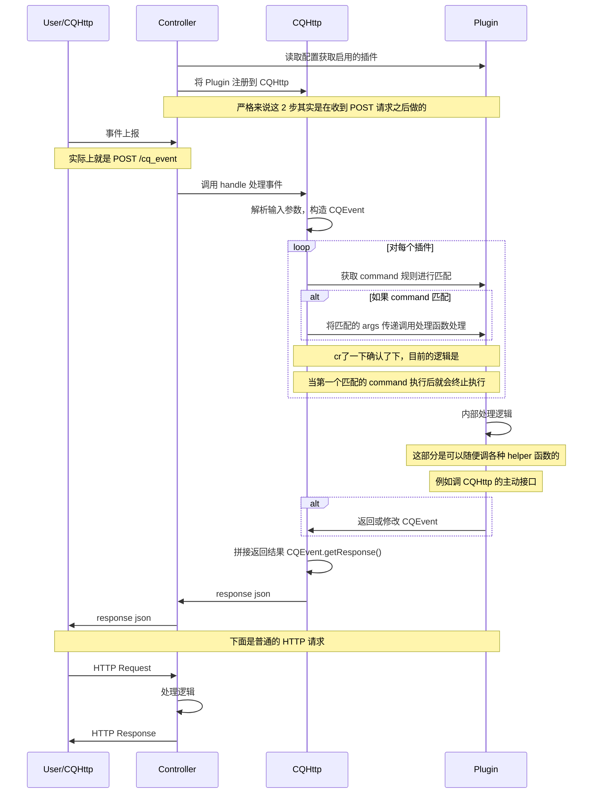

# bot 框架架构

```mermaid
sequenceDiagram
    participant u as User/CQHttp
    participant c as Controller
    participant cq as CQHttp
    participant p as Plugin

    c->>p: 读取配置获取启用的插件
    c->>cq: 将 Plugin 注册到 CQHttp
    note over c,p: 严格来说这 2 步其实是在收到 POST 请求之后做的
    u->>c: 事件上报
    note over u, c: 实际上就是 POST /cq_event
    c->>cq: 调用 handle 处理事件
    cq->>cq: 解析输入参数，构造 CQEvent
    loop 对每个插件
        cq->>p: 获取 command 规则进行匹配
        alt 如果 command 匹配
            cq->>p: 将匹配的 args 传递调用处理函数处理
        end
        note over cq, p: cr了一下确认了下，目前的逻辑是
        note over cq, p: 当第一个匹配的 command 执行后就会终止执行
    end
    p->>p: 内部处理逻辑
    note over p: 这部分是可以随便调各种 helper 函数的
    note over p: 例如调 CQHttp 的主动接口
    alt
        p->>cq: 返回或修改 CQEvent
    end
    cq->>cq: 拼接返回结果 CQEvent.getResponse()
    cq->>c: response json
    c->>u: response json

    note over u, p: 下面是普通的 HTTP 请求
    u->>c: HTTP Request
    c->>c: 处理逻辑
    c->>u: HTTP Response
```