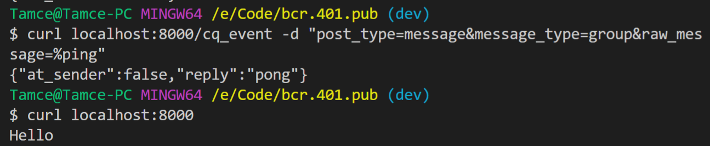

# 开发环境配置
- [开发环境配置](#开发环境配置)
  - [php](#php)
    - [1. 下载解压](#1-下载解压)
    - [2. 添加 path（略）](#2-添加-path略)
    - [3. 修改 php.ini](#3-修改-phpini)
    - [4. 验证安装](#4-验证安装)
  - [composer （包管理）](#composer-包管理)
  - [mysql (略，建议低版本5.6，高版本需要用 legacy authentication)](#mysql-略建议低版本56高版本需要用-legacy-authentication)
  - [4. run and test](#4-run-and-test)
    - [4.1 初始化配置](#41-初始化配置)
    - [4.2 安装依赖](#42-安装依赖)
    - [4.3 初始化数据库](#43-初始化数据库)
    - [4.4 run and test](#44-run-and-test)
## php
### 1. 下载解压
上 [php 官网](php.net)下载 php 可执行文件，需要 `php: ^7.1`，为保证群友测试和运行环境统一，建议保持一致
* https://windows.php.net/download#php-7.3
### 2. 添加 path（略）
### 3. 修改 php.ini
```
cd {php-install-dir}
cp php.ini-development php.ini
```
修改如下内容（善用搜索）
1. `default.timezone`
2. 搜索 `windows`，然后把 include path 和 ext dir 的注释去掉
3. 搜索 `extension=`，然后把常用的 extension 去掉注释，不确定可以尽可能多的启用 extension，确保在 cli 下跑一下 `php -m` 不会崩就行

### 4. 验证安装
```
bash> php -i
bash> php -m
```

---
## composer （包管理）
Follow the instruction on https://pkg.phpcomposer.com/#how-to-install-composer  
**推荐全局安装**

---
## mysql (略，建议低版本5.6，高版本需要用 legacy authentication)

---
## 4. run and test
### 4.1 初始化配置
```sh
cd {this-project}
cp .env.example .env
```
* 设置 `.env` 的数据库相关配置
* 设置 `PLUGINS`，为 `src/Modules/Plugins` 下启用的插件

### 4.2 安装依赖
```
composer install
```
可能会很多下载超时或者失败，可以尝试切换国内镜像或者挂全局梯子

### 4.3 初始化数据库
```sh
# create tables
php setup.php create
# drop tables
php setup.php drop
```
目前暂时没有维护数据库的版本，`schema` 修改全靠 `drop & create`，线上的 `schema` 修改....暂时还是手动的（理论上可以接入 `laravel:migration`，但是懒）

### 4.4 run and test
启动 simple server
```sh
# localhost:8000 可以改成其他监听的 host:port
php -S localhost:8000 -t public
```

访问测试
```sh
# expect hello
curl localhost:8000
# expect reply pong
curl localhost:8000/cq_event -d "post_type=message&message_type=group&raw_message=%ping"
```

* 注意：因为基本的事件构造只需要 `post_type, message_type, raw_message` 这几个参数，所以本地测试的时候即使事件参数不完整，也能走完插件的大部分流程... 当然，如果插件用到的参数没有给，那插件里拿到的就是空